# SMS Service System — Full Documentation

**Developed by Mobile 2000 Company**
> A complete bulk SMS platform that allows businesses to register, purchase message credits, and send SMS messages through multiple telecom providers in Kuwait.

---

## Table of Contents

1. [System Overview](#1-system-overview)
2. [Architecture Diagram](#2-architecture-diagram)
3. [Server Infrastructure](#3-server-infrastructure)
4. [Database — Microsoft SQL Server](#4-database--microsoft-sql-server)
5. [SMSWebService — SOAP API](#5-smswebservice--soap-api)
6. [SMS Providers](#6-sms-providers)
7. [SMSON — Web Application](#7-smson--web-application)
8. [SMSON Server Log](#8-smson-server-log)
9. [Tech Stack Summary](#9-tech-stack-summary)
10. [Flow Diagrams](#10-flow-diagrams)

---

## 1. System Overview

The SMS Service is an end-to-end bulk messaging platform consisting of six integrated components:

| # | Component | Purpose |
|---|---|---|
| 1 | **Server** | VMware-hosted Windows Server, entry point for all services |
| 2 | **MSSQL Database** | Stores users, originators, message queues, and balances |
| 3 | **SMSWebService** | SOAP/HTTP API that processes and dispatches SMS messages |
| 4 | **SMS Providers** | Zain, Viva, Sinch (telecom gateways that deliver messages) |
| 5 | **SMSON Web App** | ASP.NET MVC portal for admins and end users |
| 6 | **SMS ON Server Log** | Internal monitoring dashboard for queue and account activity |

---

## 2. Architecture Diagram

```
┌───────────────────────────────────────────────────────────────────┐
│                        USER / ADMIN BROWSER                       │
│                                                                   │
│             https://www.smson.com  (SMSON Web App)                │
└────────────────────────────┬──────────────────────────────────────┘
                             │ HTTPS (Port 443)
┌────────────────────────────▼──────────────────────────────────────┐
│              APPLICATION SERVER — VMware vSphere                  │
│         Guest OS: Windows Server 2008 R2 (64-bit)                 │
│         IP: 192.168.100.10  |  DNS: WIN-IL24UFSB77V               │
│         CPU: 352 MHz  |  RAM: 3.52 GB  |  Storage: 609 GB         │
│                                                                   │
│  ┌───────────────────┐     ┌──────────────────────────────────┐   │
│  │  SMSON Web App    │     │     SMSWebService (.asmx)        │   │
│  │  ASP.NET MVC      │────>│  SOAP over HTTP POST             │   │
│  │  Bootstrap+jQuery │     │  auth / originators / send /     │   │
│  └───────────────────┘     │  sendv2                          │   │
│                            └──────────────┬───────────────────┘   │
│                                           │ TCP 1433              │
│                            ┌──────────────▼───────────────────┐   │
│                            │   Microsoft SQL Server           │   │
│                            │   dbo.users                      │   │
│                            │   dbo.originators                │   │
│                            │   dbo.queue                      │   │
│                            │   dbo.pendingQueue               │   │
│                            └──────────────────────────────────┘   │
│                                                                   │
│  ┌─────────────┐  ┌─────────────┐  ┌─────────────┐                │
│  │sinchConsole │  │vivaConsole  │  │zainConsole  │  smsConsole    │
│  │ (Sinch)     │  │ (Viva/SNPP) │  │ (Zain BMS)  │  (Queue)       │
│  └──────┬──────┘  └──────┬──────┘  └──────┬──────┘                │
└─────────┼────────────────┼────────────────┼────────────────────── ┘
          │                │                │  HTTPS / SMPP / SNPP
          ▼                ▼                ▼
┌────────────────────────────────────────────────────────────────┐
│                   TELECOM PROVIDER LAYER                       │
│                                                                │
│   ┌──────────────┐  ┌──────────────┐  ┌──────────────┐         │
│   │     ZAIN     │  │     VIVA     │  │    SINCH     │         │
│   │ bms.kw.zain  │  │  SNPP Bound  │  │   (SMPP)     │         │
│   │ .com/bms     │  │              │  │              │         │
│   └──────┬───────┘  └──────┬───────┘  └──────┬───────┘         │
└──────────┼─────────────────┼─────────────────┼─────────────────┘
           │                 │                 │ SS7 / Telecom
           ▼                 ▼                 ▼
                    [End User Mobile Phone]
```

---

## 3. Server Infrastructure

### VMware vSphere Host

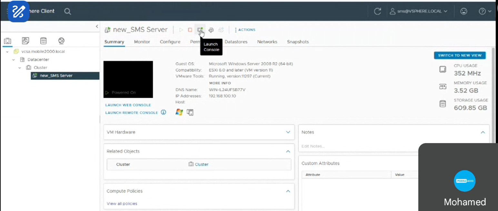

| Property | Value |
|---|---|
| VM Name | `new_SMS Server` |
| Guest OS | Microsoft Windows Server 2008 R2 (64-bit) |
| Compatibility | ESXi 6.0 and later (VM version 11) |
| VMware Tools | Running, version 11297 (Current) |
| DNS Name | `WIN-IL24UFSB77V` |
| IP Address | `192.168.100.10` |
| CPU Usage | 352 MHz |
| Memory Usage | 3.52 GB |
| Storage Usage | 609.85 GB |
| vCenter | `vcsa.mobile2000.local` → Datacenter → Cluster |

### Console Processes Running on Server

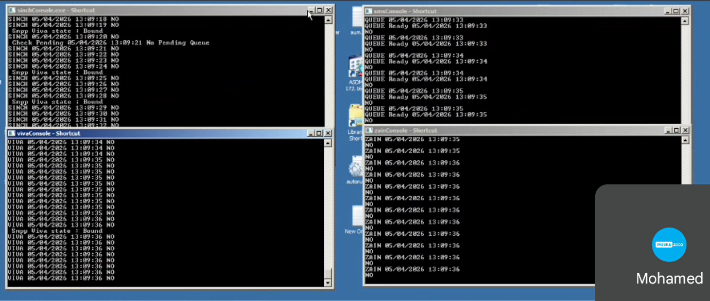

Four console processes run continuously, each polling a provider for pending messages:

| Console | Provider | Protocol | Log Sample |
|---|---|---|---|
| `sinchConsole.exe` | Sinch | SMPP | `SINCH 05/04/2026 13:09:21 No Pending Queue` |
| `vivaConsole.exe` | Viva | SNPP (Bound state) | `VIVA 05/04/2026 13:09:35 NO` |
| `zainConsole.exe` | Zain | HTTP/BMS | `ZAIN 05/04/2026 13:09:36 NO` |
| `smsConsole.exe` | Queue dispatcher | Internal | `QUEUE Ready 05/04/2026 13:09:33` |

---

## 4. Database — Microsoft SQL Server

**Connection:** `WIN-IL24UFSB77V\sms2000` (SQL Server 10.50.x)
**Managed via:** Microsoft Visual Studio Server Explorer + SSMS

### All Tables

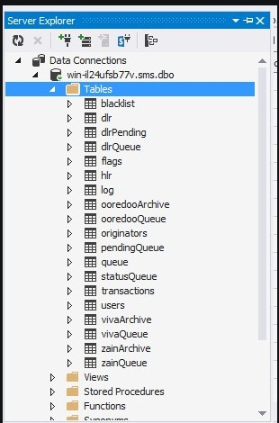

The database contains the following tables:

### Core Tables

| Table | Description |
|---|---|
| `dbo.users` | Stores all registered users (credentials, token, mobile, email, city, credit, balance, route, limit, etc.) |
| `dbo.originators` | Stores approved sender names per user per telecom provider (Zain, Ooredoo, Viva) |
| `dbo.pendingQueue` | Holds scheduled/timed messages or messages that failed to send |
| `dbo.queue` | Holds messages ready to be dispatched (supports scheduled flag) |
| `dbo.transactions` | Records all balance transactions per user (credit, balance, datetime, details) |

### Provider-Specific Tables

| Table | Description |
|---|---|
| `dbo.zainQueue` | Outbound message queue specific to Zain provider |
| `dbo.zainArchive` | Archive of messages delivered via Zain |
| `dbo.vivaQueue` | Outbound message queue specific to Viva provider |
| `dbo.vivaArchive` | Archive of messages delivered via Viva |
| `dbo.ooredooQueue` | Outbound message queue specific to Ooredoo provider |
| `dbo.ooredooArchive` | Archive of messages delivered via Ooredoo |

### Delivery Report (DLR) Tables

| Table | Description |
|---|---|
| `dbo.dlr` | Delivery reports received from providers |
| `dbo.dlrPending` | Delivery reports awaiting processing |
| `dbo.dlrQueue` | Queue of delivery reports to be matched to sent messages |

### System & Utility Tables

| Table | Description |
|---|---|
| `dbo.blacklist` | Blocked numbers that cannot receive messages |
| `dbo.flags` | System-wide configuration flags |
| `dbo.hlr` | HLR (Home Location Register) lookup records |
| `dbo.log` | General system event log |
| `dbo.statusQueue` | Tracks current status of messages in the pipeline |

### Table Screenshots

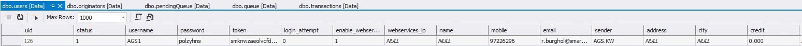


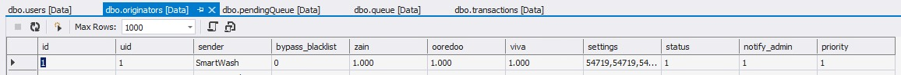

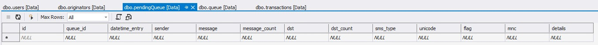

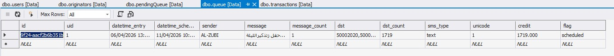

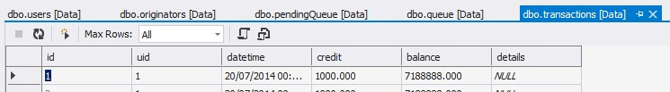

### Balance Management via SSMS

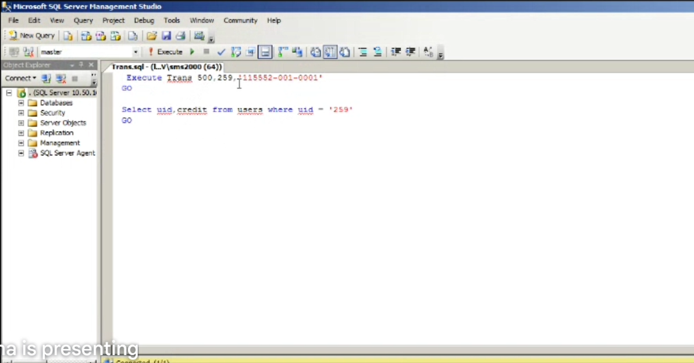

Admins assign balance to users by running a stored procedure in SSMS:

```sql
-- Assign 500 credits to user 259 with invoice number
Execute Trans 500, 259, '115552-001-0001'
GO

-- Verify credit was applied
Select uid, credit from users where uid = '259'
GO
```

---

## 5. SMSWebService — SOAP API

**Endpoint:** `POST /SmsWebService.asmx`
**Host:** `server.smson.com`
**Protocol:** SOAP 1.1 over HTTP POST
**SOAPAction namespace:** `http://62.150.26.41/`

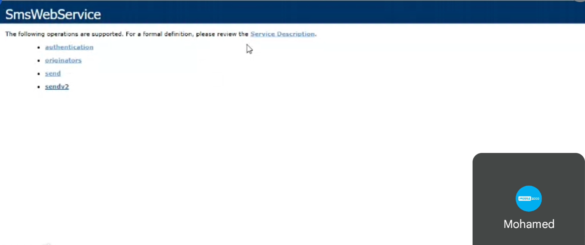

The service exposes 4 operations:

---

### 5.1 `authentication`

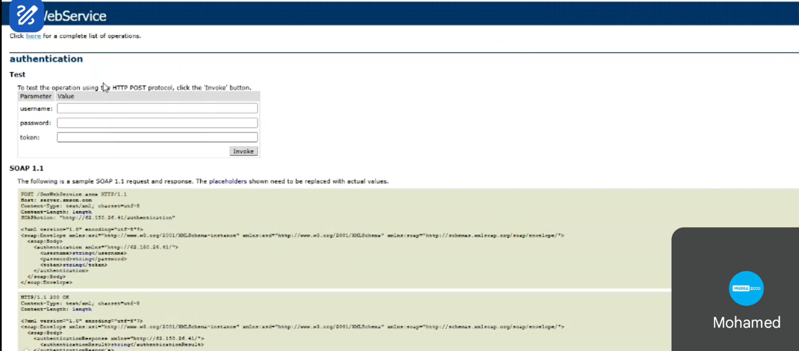

Validates user credentials and token.

**Parameters:**

| Parameter | Type |
|---|---|
| `username` | string |
| `password` | string |
| `token` | string |

**SOAP 1.1 Request:**
```xml
POST /SmsWebService.asmx HTTP/1.1
Host: server.smson.com
Content-Type: text/xml; charset=utf-8
SOAPAction: "http://62.150.26.41/authentication"

<?xml version="1.0" encoding="utf-8"?>
<soap:Envelope xmlns:xsi="http://www.w3.org/2001/XMLSchema-instance"
               xmlns:xsd="http://www.w3.org/2001/XMLSchema"
               xmlns:soap="http://schemas.xmlsoap.org/soap/envelope/">
  <soap:Body>
    <authentication xmlns="http://62.150.26.41/">
      <username>string</username>
      <password>string</password>
      <token>string</token>
    </authentication>
  </soap:Body>
</soap:Envelope>
```

**Response:** `<authenticationResult>string</authenticationResult>`

---

### 5.2 `originators`

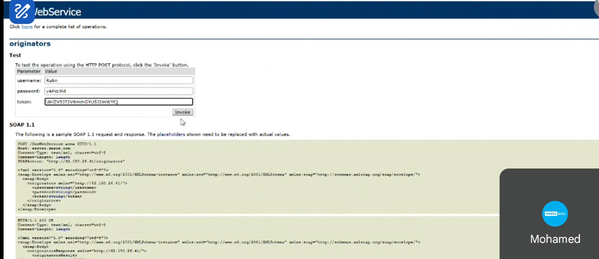

Returns the list of approved sender names for the authenticated user.

**Parameters:**

| Parameter | Type |
|---|---|
| `username` | string |
| `password` | string |
| `token` | string |

**SOAP 1.1 Request:**
```xml
POST /SmsWebService.asmx HTTP/1.1
Host: server.smson.com
Content-Type: text/xml; charset=utf-8
SOAPAction: "http://62.150.26.41/originators"

<?xml version="1.0" encoding="utf-8"?>
<soap:Envelope ...>
  <soap:Body>
    <originators xmlns="http://62.150.26.41/">
      <username>string</username>
      <password>string</password>
      <token>string</token>
    </originators>
  </soap:Body>
</soap:Envelope>
```

**Response (XML):**

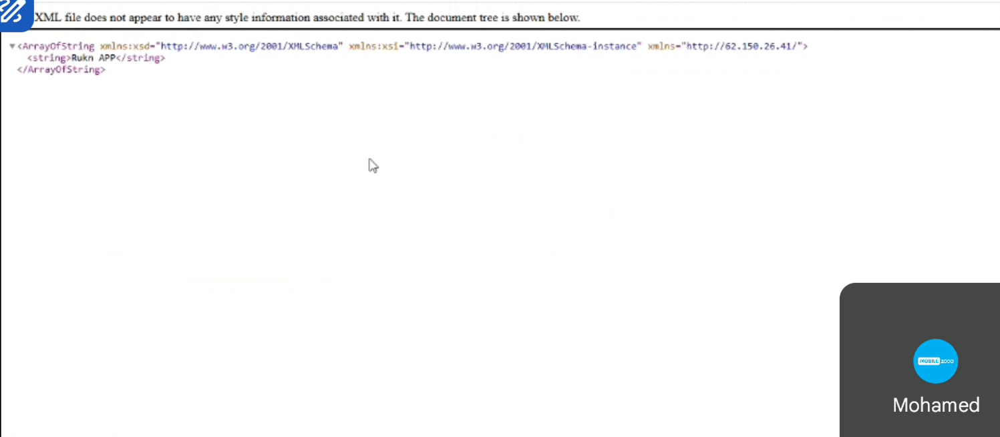

```xml
<ArrayOfString xmlns:xsd="http://www.w3.org/2001/XMLSchema"
               xmlns:xsi="http://www.w3.org/2001/XMLSchema-instance"
               xmlns="http://62.150.26.41/">
  <string>Rukn APP</string>
</ArrayOfString>
```

---

### 5.3 `send`

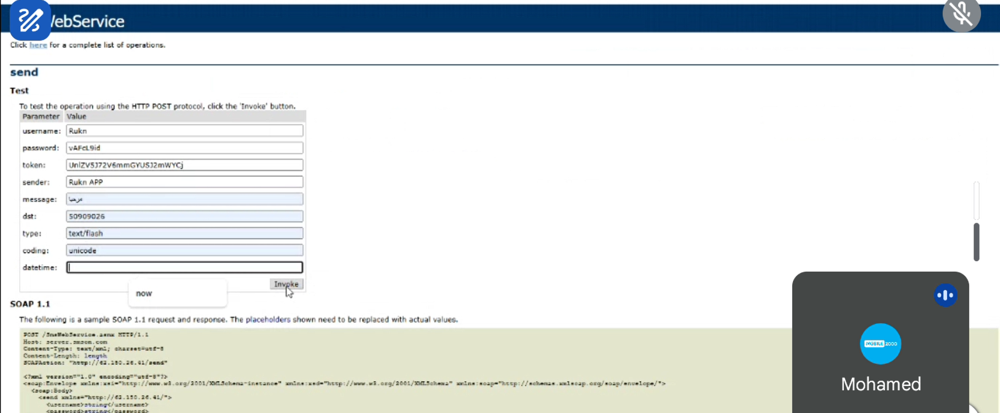

Sends an SMS message immediately or at a scheduled time.

**Parameters:**

| Parameter | Type | Example |
|---|---|---|
| `username` | string | `Rukn` |
| `password` | string | `vAFcL9id` |
| `token` | string | `UnlZV5J72V6mmGYUSJ2mWYCj` |
| `sender` | string | `Rukn APP` |
| `message` | string | Message text (Arabic/English) |
| `dst` | string | `50909026` |
| `type` | string | `text/flash` |
| `coding` | string | `unicode` |
| `datetime` | string | Leave empty for `now`, or set scheduled time |

**SOAP 1.1 Request:**
```xml
POST /SmsWebService.asmx HTTP/1.1
Host: server.smson.com
Content-Type: text/xml; charset=utf-8
SOAPAction: "http://62.150.26.41/send"

<?xml version="1.0" encoding="utf-8"?>
<soap:Envelope ...>
  <soap:Body>
    <send xmlns="http://62.150.26.41/">
      <username>string</username>
      <password>string</password>
      <token>string</token>
      <sender>string</sender>
      <message>string</message>
      <dst>string</dst>
      <type>string</type>
      <coding>string</coding>
      <datetime>string</datetime>
    </send>
  </soap:Body>
</soap:Envelope>
```

---

### 5.4 `sendv2`

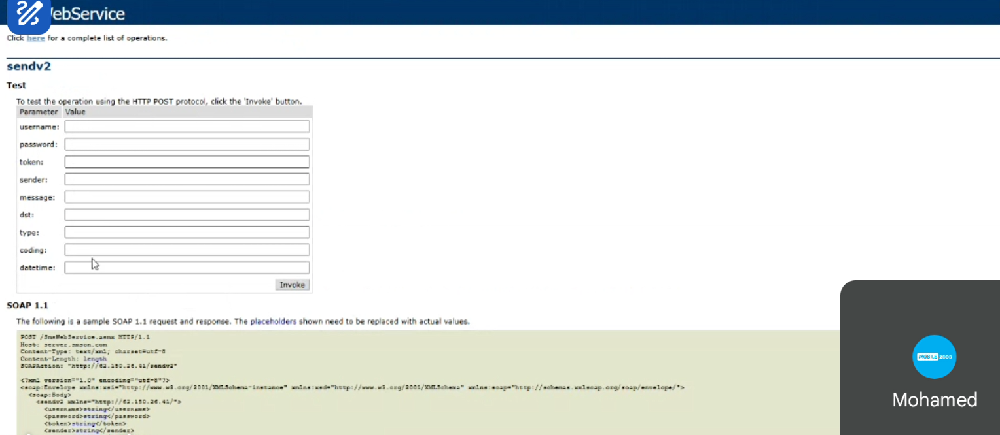

Same as `send` but uses an updated routing version. Identical parameter structure.

**SOAPAction:** `"http://62.150.26.41/sendv2"`

> Note: Before using the API, the user's IP address must be whitelisted in **Firebase** and the `webservices_ip` field in `dbo.users` must be updated accordingly.

---

## 6. SMS Providers

Three telecom providers are used to deliver messages to end users. Each has its own console process running on the server.

### 6.1 Zain

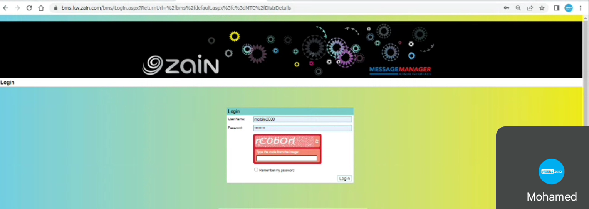

| Property | Value |
|---|---|
| Portal | bms.kw.zain.com/bms |
| System Name | Message Manager — Admin Interface |
| Auth | Username + Password + CAPTCHA |
| Console | `zainConsole.exe` |

### 6.2 Viva

| Property | Value |
|---|---|
| Protocol | SNPP (Simple Network Paging Protocol) |
| Connection State | Bound |
| Console | `vivaConsole.exe` |

### 6.3 Sinch

| Property | Value |
|---|---|
| Protocol | SMPP |
| Console | `sinchConsole.exe` |

All three providers are accessed using their own username/password credentials. The balances purchased from providers fund the credits distributed to SMSON end users.

---

## 7. SMSON — Web Application

**URL:** www.smson.com
**Framework:** ASP.NET MVC + Bootstrap + jQuery
**Language:** Arabic (default) with English toggle
**Auth:** ASP.NET Identity (mobile number + password + token)
**Analytics:** Azure Application Insights

---

### Navigation Bar

```
SMSON | إرسال | السجل | أسماء الإرسال | المجموعات | المستخدمين | مرحبا [user] | الرصيد [balance] | تسجيل الخروج
```

| Menu Item | Arabic | Description |
|---|---|---|
| Send | إرسال | Send SMS messages |
| Log / Archive | السجل | View sent message history |
| Send Names | أسماء الإرسال | Manage sender names (originators) |
| Groups | المجموعات | Manage number groups |
| Users | المستخدمين | Admin: manage all users |
| Balance | الرصيد | Current credit balance |
| Logout | تسجيل الخروج | Sign out |

---

### 7.1 Login Page — `/Account/Login`

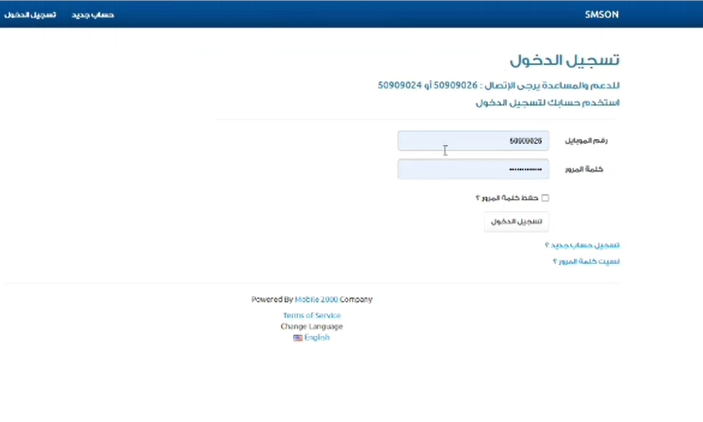

| Field | Arabic Label |
|---|---|
| Mobile Number | رقم الموبايل |
| Password | كلمة المرور |
| Remember Password | حفظ كلمة المرور ؟ |
| Login Button | تسجيل الدخول |

- Links to: Register, Forgot Password
- Support: 50909026 أو 50909024

---

### 7.2 Register Page — `/Account/Register`

| Field | Arabic Label |
|---|---|
| Mobile Number | رقم الموبايل |
| Password | كلمة المرور |
| Confirm Password | تأكيد كلمة المرور |

- reCAPTCHA required
- Must accept Terms of Service + Privacy Policy

---

### 7.3 Forgot Password — `/Account/ForgotPassword`

- Enter mobile number
- reCAPTCHA check
- SMS code sent to mobile → `/Account/ResetVerifyCode`

---

### 7.4 Send Message Page — إرسال رسالة

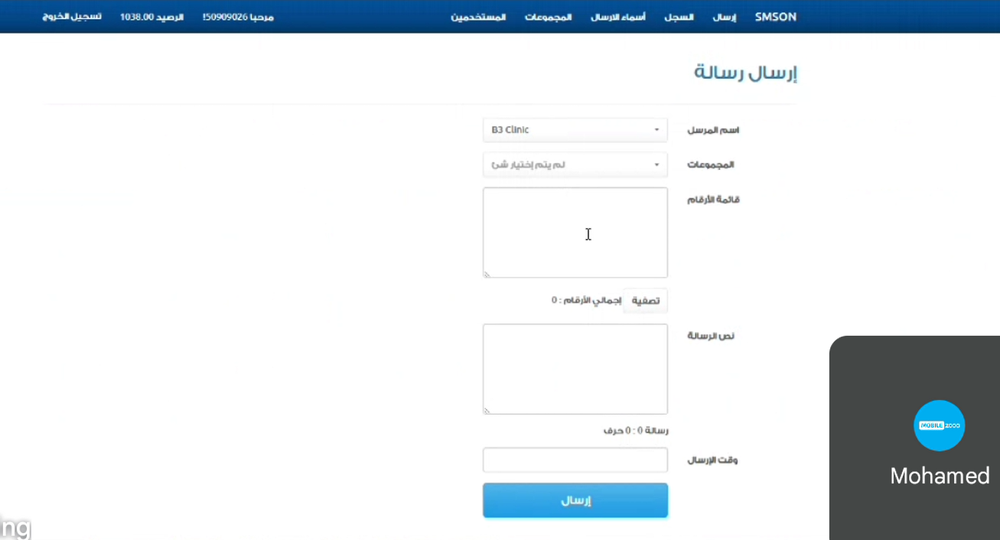

| Field | Arabic Label | Notes |
|---|---|---|
| Sender Name | اسم المرسل | Dropdown from approved originators |
| Groups | المجموعات | Select a contact group |
| Number List | قائمة الأرقام | Paste destination numbers manually |
| Filter | تصفية | Clean/filter number list |
| Total Numbers | إجمالي الأرقام | Auto-counted |
| Message Text | نص الرسالة | Auto-splits if > 70 chars (Arabic) or 160 (English) |
| Character Count | رسالة X : Y حرف | Shows part count and character count |
| Send Time | وقت الإرسال | Leave empty for now, or schedule future datetime |
| Send Button | إرسال | Submits message |

---

### 7.5 Users Page — `/Users/Index` (Admin Only)

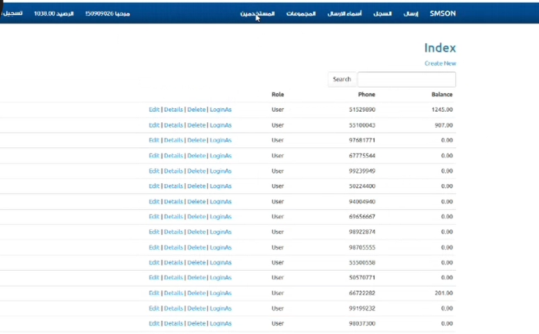

Displays all registered users with their role, phone, and balance.

| Column | Description |
|---|---|
| Role | User / Admin |
| Phone | Mobile number |
| Balance | Current credit balance |

**Actions per user:**

| Action | Description |
|---|---|
| Edit | Modify user details |
| Details | View full user profile |
| Delete | Remove user account |
| LoginAs | Impersonate user (admin feature) |
| Create New | Register a new user |
| Search | Filter users from DB |

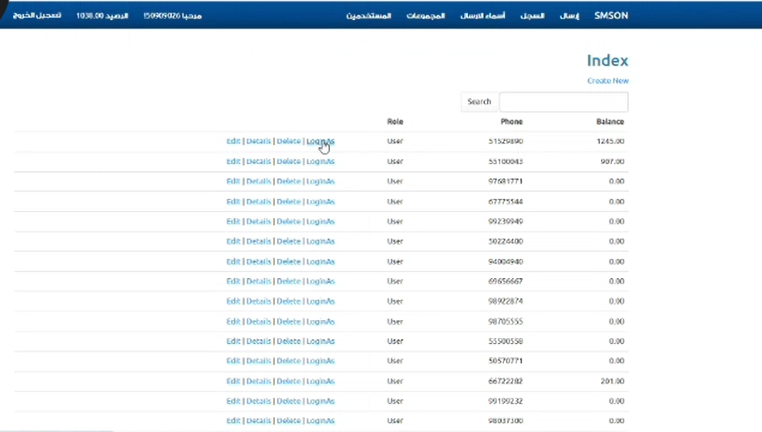

---

### 7.6 Buy Balance — شراء رصيد

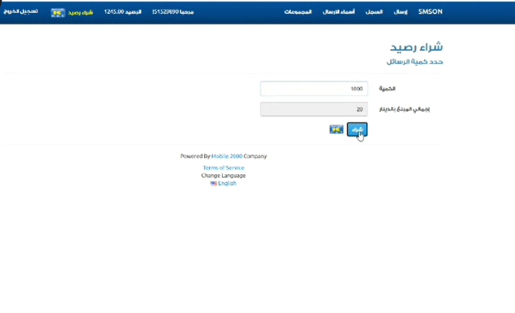

Available to users and admins (via LoginAs).

| Field | Description |
|---|---|
| Quantity | Number of messages to purchase |
| Total Amount | Calculated in Kuwaiti Dinar (KD) |
| Buy Button | Redirects to bank payment gateway |

**Payment Gateway: ABK Bank (KNET)**

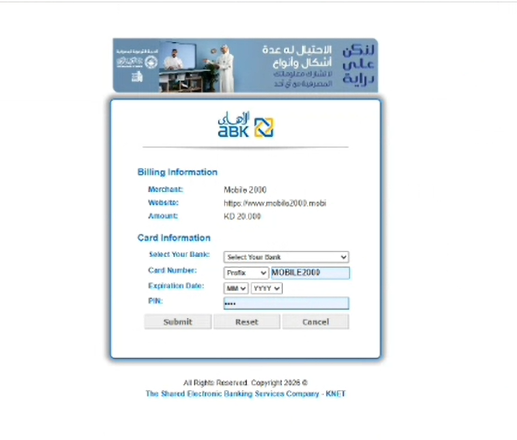

| Field | Detail |
|---|---|
| Merchant | Mobile 2000 |
| Website | https://www.mobile2000.mobi |
| Payment | KNET — The Shared Electronic Banking Services Company |
| Card Info | Bank selection + Card number + Expiry + PIN |

After payment → redirected to admin to confirm → admin creates balance record.

---

### 7.7 Admin Create Balance

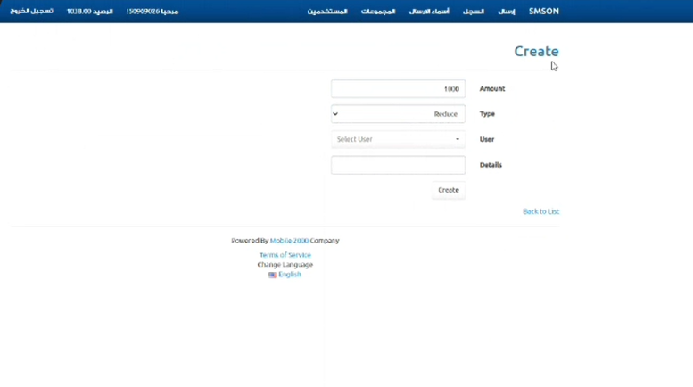

| Field | Description |
|---|---|
| Amount | Number of SMS credits |
| Type | Add / Reduce |
| User | Select user from dropdown |
| Details | Invoice number or note |

---

### 7.8 Groups Page — المجموعات

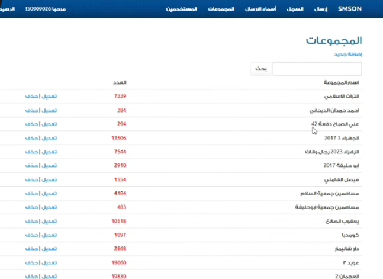

| Column | Description |
|---|---|
| Group Name | اسم المجموعة |
| Count | العدد — number of contacts in group |

Actions: Edit (تعديل) | Delete (حذف) | Add New (إضافة جديد) | Search (بحث)

Example groups: البنات الاسلامي (7,339 numbers), يعقوب الصالح (10,518), عود 3 (19,060), العجمان 2 (19,830)

---

### 7.9 Send Names (Originators) — أسماء الإرسال

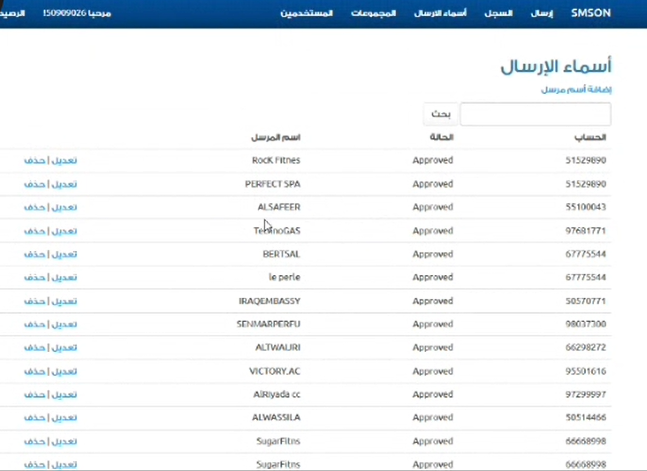

Manages approved sender names per user account.

| Column | Description |
|---|---|
| Account | User account (mobile number) |
| Status | Approved / Pending |
| Sender Name | اسم المرسل |

Actions: Edit (تعديل) | Delete (حذف) | Add Sender Name (إضافة اسم مرسل) | Search

---

### 7.10 Archive / Log — سجل الرسائل

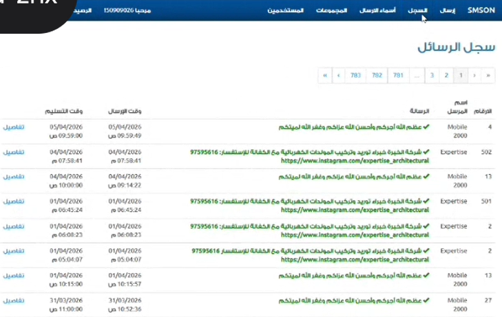

Full log of all sent messages with pagination (783+ pages).

| Column | Description |
|---|---|
| Numbers | Destination count |
| Sender Name | اسم المرسل |
| Message | Message content |
| Send Time | وقت الإرسال |
| Receive Time | وقت التسليم |
| Details | تفاصيل — link to message detail |

---

## 8. SMSON Server Log

**URL:** `https://192.168.100.99/login` (internal network only)
**Auth:** Username + Password (simple form, green-themed UI)


Internal monitoring dashboard with 4 tabs:

### Tabs

| Tab | Description |
|---|---|
| Home | Dashboard overview |
| Log | Full archive of all sent messages |
| Queue | Current pending/scheduled queue |
| Account | Balance and account info (e.g., 234,666.000 credits) |

### Log View

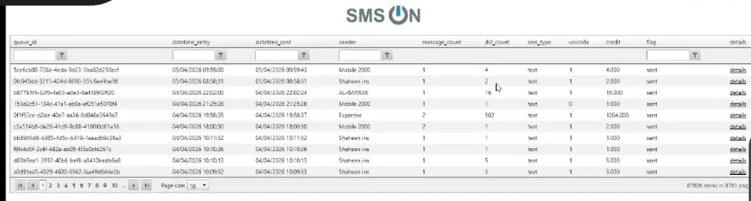

| Column | Description |
|---|---|
| `queue_id` | Unique message GUID |
| `datetime_entry` | When message was created |
| `datetime_sent` | When message was delivered |
| `sender` | Sender name |
| `message_count` | Number of SMS parts |
| `dst_count` | Number of recipients |
| `sms_type` | text / flash |
| `unicode` | 0 or 1 |
| `credit` | Credits consumed (e.g., 4.000, 16.000) |
| `flag` | Delivery status (`sent`) |
| `details` | Detail link |

### Queue View

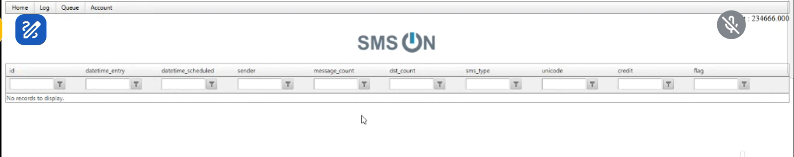

| Column | Description |
|---|---|
| `id` | Queue record ID |
| `datetime_entry` | Entry timestamp |
| `datetime_scheduled` | Scheduled send time |
| `sender` | Sender name |
| `message_count` | SMS parts |
| `dst_count` | Destination count |
| `sms_type` | Message type |
| `unicode` | Encoding |
| `credit` | Cost in credits |
| `flag` | Status |

> Shows "No records to display" when queue is empty — all messages have been processed.

---

## 9. Tech Stack Summary

| Layer | Technology |
|---|---|
| **Frontend Web App** | Angular 18+ (TypeScript, SSR — this repository) |
| **Admin/User Portal** | ASP.NET MVC, Bootstrap, jQuery, jQuery Validation |
| **SOAP API** | ASP.NET Web Service (.asmx), SOAP 1.1 over HTTP POST |
| **Database** | Microsoft SQL Server 2008 R2 (TCP 1433) |
| **DB Management** | Microsoft Visual Studio Server Explorer + SSMS |
| **Server Host** | VMware vSphere ESXi 6.0 |
| **Server OS** | Windows Server 2008 R2 (64-bit) |
| **Identity & Auth** | ASP.NET Identity, Token-based API auth |
| **IP Access Control** | Firebase (IP whitelist per user) |
| **Monitoring** | Azure Application Insights |
| **Payment Gateway** | KNET / ABK Bank |
| **SMS Provider 1** | Zain (bms.kw.zain.com — HTTP/BMS) |
| **SMS Provider 2** | Viva (SNPP protocol) |
| **SMS Provider 3** | Sinch (SMPP protocol) |
| **Email** | SMTP (sends credentials to new users) |
| **Language** | Arabic (primary) + English |
| **Company** | Mobile 2000 |

---

## 10. Flow Diagrams

### New User Registration & Setup

```
Admin creates user in SMSON
        │
        ▼
SQL: INSERT into dbo.users
(username, password, token, mobile, email)
        │
        ▼
Email sent to user with credentials
(username + password + token)
        │
        ▼
User IP whitelisted in Firebase
+ webservices_ip updated in dbo.users
        │
        ▼
Admin runs SSMS script:
Execute Trans [amount], [uid], '[invoice_number]'
        │
        ▼
User now has balance and can send SMS
```

---

### Send SMS Flow

```
User logs into SMSON
        │
        ▼
Fills Send Message form:
sender + numbers + message + [datetime]
        │
        ▼
SMSON calls SMSWebService
via SOAP/HTTP POST with:
username, password, token, sender,
message, dst, type, coding, datetime
        │
        ├──► If datetime = now ──► dbo.queue (immediate)
        │
        └──► If datetime = future ──► dbo.pendingQueue (scheduled)
                                           │
                                    Server polls pendingQueue
                                    moves to queue at scheduled time
                                    (error → stays in pendingQueue)
        │
        ▼
smsConsole picks message from dbo.queue
        │
        ├──► zainConsole ──► Zain BMS ──► Mobile Network
        ├──► vivaConsole ──► Viva SNPP ──► Mobile Network
        └──► sinchConsole ──► Sinch SMPP ──► Mobile Network
        │
        ▼
Message delivered to end user phone
        │
        ▼
Record archived in SMS ON Server Log
(datetime_entry, datetime_sent, credit, flag=sent)
```

---

### Buy Balance Flow

```
User (or Admin via LoginAs)
        │
        ▼
/Balance/Buy — select message quantity
Total = quantity × price (KD)
        │
        ▼
Redirect to KNET/ABK payment gateway
Enter: Bank + Card number + Expiry + PIN
        │
        ▼
Payment confirmed by bank
Redirect back to SMSON
        │
        ▼
Admin confirms payment
Creates balance record:
Amount + Type=Add + User + Details(invoice)
        │
        ▼
OR Admin runs SSMS script directly:
Execute Trans [amount], [uid], '[invoice]'
        │
        ▼
dbo.users.credit updated
User balance shown in navbar: الرصيد [X]
```

---

*Powered by **Mobile 2000 Company** — mobile2000.com*
